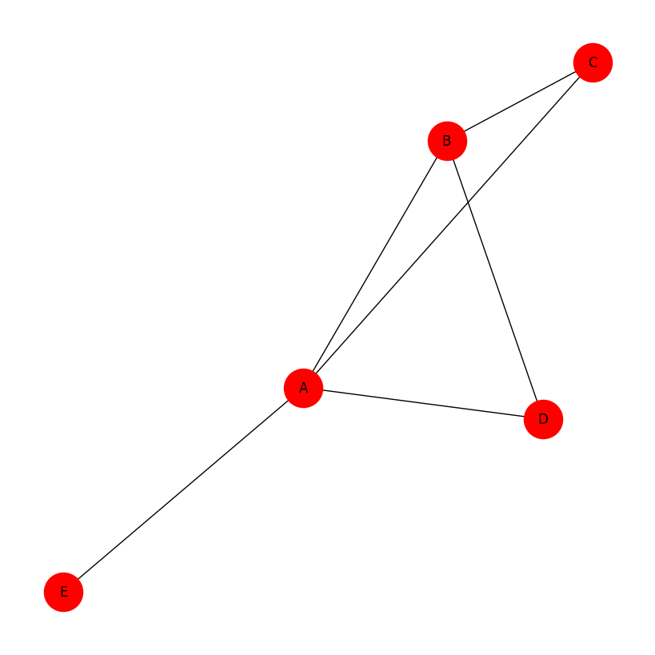

# Análise de redes com NetworkX – introdução à teoria dos grafos

A *Teoria dos Grafos*, ramo da Matemática que utiliza conceitos fundamentais para representar objetos abstratos definidos como **nós** (ou *vértices*) e **arestas** (ou *conexões*), lida com estruturas abstratas de relações. Em termos práticos, fornece um conjunto de conceitos, modelos e algoritmos que são utilizados para a análise de redes.

As redes são definidas como *grafos*, estruturas na forma de diagramas compostas por dois conjuntos de objetos: **nós** ou **vértices**, que representam as *entidades* e **arestas**, que representam as *relações* entre as *entidades*. Formalmente, o grafo é representado pela função: G = (*V*, *E*), onde *V* denota o conjunto de *vértices* ou *nós* e *E* o conjunto de *arestas*.

### Importamos as bibliotecas


```python
import networkx as nx
import matplotlib.pyplot as plt
from itertools import permutations
import time
import random
```

### Criamos o grafo


```python
# Grafo vazio
G = nx.Graph()

# Nós (cidades)
cidades = ['A', 'B', 'C', 'D', 'E']
for cidade in cidades:
    G.add_node(cidade, pos=(random.randint(0, 100), random.randint(0, 100)))

# Arestas com pesos (distâncias em km)
distancias = [
    ('A', 'B', 10), ('A', 'C', 15), ('A', 'D', 20), ('A', 'E', 25),
    ('B', 'C', 35), ('B', 'D', 25)
]

for origem, destino, peso in distancias:
    G.add_edge(origem, destino, weight=peso)

print(f"Nós: {G.nodes()}")
print(f"Arestas: {G.edges(data=True)}")
```

    Nós: ['A', 'B', 'C', 'D', 'E']
    Arestas: [('A', 'B', {'weight': 10}), ('A', 'C', {'weight': 15}), ('A', 'D', {'weight': 20}), ('A', 'E', {'weight': 25}), ('B', 'C', {'weight': 35}), ('B', 'D', {'weight': 25})]


```python
plt.figure(figsize=(8, 8))
nx.draw(G, with_labels=True, node_size=1200, node_color='red')
plt.show()
```


    

    


### Listamos as propriedades básicas


```python
print(f"Tipo: {type(G).__name__}")
print(f"Direcionado? {G.is_directed()}")
print(f"Nós (ordem): {G.number_of_nodes()}")
print(f"Arestas (tamanho): {G.number_of_edges()}")
print(f"Conexo? {nx.is_connected(G)}")
print(f"Ponderado? {len(list(G.edges(data=True))) > 0}")
```

    Tipo: Graph
    Direcionado? False
    Nós (ordem): 5
    Arestas (tamanho): 6
    Conexo? True
    Ponderado? True


Grafo simples, não direcionado, conexo e ponderado.

### Realizamos análise de graus

**Grau** = número de arestas incidentes a um nó.


```python
print("Grau por nó:")
for no in G.nodes():
    print(f"  {no}: {G.degree(no)}")

graus = [d for n, d in G.degree()]
print(f"\nMédio: {sum(graus)/len(graus):.2f}")
print(f"Mínimo: {min(graus)}")
print(f"Máximo: {max(graus)}")
```

    Grau por nó:
      A: 4
      B: 3
      C: 2
      D: 2
      E: 1
    
    Médio: 2.40
    Mínimo: 1
    Máximo: 4


Nó **A** é o *hub* central (conectado a todos). Nó **E** é periférico (grau 1).


### Medidas de centralidade

**Grau** (normalizado

*CD(v) = grau(v) / (n-1)*


```python
centralidade_grau = nx.degree_centrality(G)
for no, valor in sorted(centralidade_grau.items(), key=lambda x: x[1], reverse=True):
    print(f"{no}: {valor:.3f}")
```

    A: 1.000
    B: 0.750
    C: 0.500
    D: 0.500
    E: 0.250


**Proximidade** (inverso da distância média)


```python
centralidade_proximidade = nx.closeness_centrality(G)
for no, valor in sorted(centralidade_proximidade.items(), key=lambda x: x[1], reverse=True):
    print(f"{no}: {valor:.3f}")
```

    A: 1.000
    B: 0.800
    C: 0.667
    D: 0.667
    E: 0.571


**Intermediação** (ponte em caminhos mínimos)


```python
centralidade_intermediacao = nx.betweenness_centrality(G, weight='weight')
for no, valor in sorted(centralidade_intermediacao.items(), key=lambda x: x[1], reverse=True):
    print(f"{no}: {valor:.3f}")
```

    A: 0.833
    B: 0.000
    C: 0.000
    D: 0.000
    E: 0.000


**A** é o único vértice que atua como ponte em caminhos mínimos.

**Autovetor** (influência indireta)


```python
centralidade_autovetor = nx.eigenvector_centrality(G, weight='weight', max_iter=1000)
for no, valor in sorted(centralidade_autovetor.items(), key=lambda x: x[1], reverse=True):
    print(f"{no}: {valor:.3f}")
```

    B: 0.570
    C: 0.480
    A: 0.472
    D: 0.421
    E: 0.210


Embora **A** tenha mais conexões, **B** tem maior influência porque se conecta a nós importantes.

### Caminhos mínimos e diâmetro

**Matriz de distâncias** (*Dijkstra*)


```python
distancias_curtas = dict(nx.all_pairs_dijkstra_path_length(G, weight='weight'))
print("Matriz de distâncias mais curtas:")
for origem in sorted(distancias_curtas.keys()):
    linha = f"{origem}: "
    for destino in sorted(distancias_curtas[origem].keys()):
        linha += f"{destino}({distancias_curtas[origem][destino]:2d}) "
    print(linha)
```

    Matriz de distâncias mais curtas:
    A: A( 0) B(10) C(15) D(20) E(25) 
    B: A(10) B( 0) C(25) D(25) E(35) 
    C: A(15) B(25) C( 0) D(35) E(40) 
    D: A(20) B(25) C(35) D( 0) E(45) 
    E: A(25) B(35) C(40) D(45) E( 0) 


**Diâmetro** (maior distância entre dois nós)


```python
if nx.is_connected(G):
    print(f"Diâmetro: {nx.diameter(G)}")
```

    Diâmetro: 2


**Excentricidade** (maior distância de um nó a qualquer outro)

```python
for no in G.nodes():
    print(f"{no}: {nx.eccentricity(G, v=no)}")
```

    A: 1
    B: 2
    C: 2
    D: 2
    E: 2

### Problema do Caixeiro Viajante (TSP)

**Definições:**

O **Ciclo hamiltoniano** consiste em um circuito em que o viajante visita todos os vértices ou nós somente uma vez, com retorno ao ponto de partida.<br>
O *Caminho hamiltoniano* consiste no mesmo circuito, porém sem retorno ao ponto de partida.<br>
O **TSP** clássico busca encontrar o *ciclo Hamiltoniano* de menor peso total.

**Exemplo didático com 4 cidades**


```python
G4 = nx.Graph()
cidades4 = ['A', 'B', 'C', 'D']
arestas4 = [
    ('A','B',10), ('A','C',15), ('A','D',20),
    ('B','C',35), ('B','D',25), ('C','D',30)
]
for u,v,w in arestas4:
    G4.add_edge(u,v,weight=w)
```

**Caminhos hamiltonianos** (sem retorno)


```python
def encontrar_caminhos_hamiltonianos(grafo):
    nos = list(grafo.nodes())
    primeiro = nos[0]
    restantes = nos[1:]
    caminhos = []
    for perm in permutations(restantes):
        caminho = [primeiro] + list(perm)
        valido = True
        dist = 0
        for i in range(len(caminho)-1):
            if grafo.has_edge(caminho[i], caminho[i+1]):
                dist += grafo[caminho[i]][caminho[i+1]]['weight']
            else:
                valido = False
                break
        if valido:
            caminhos.append((caminho, dist))
    return caminhos

caminhos = encontrar_caminhos_hamiltonianos(G4)
melhor_caminho = min(caminhos, key=lambda x: x[1])
print(f"Melhor caminho Hamiltoniano: {melhor_caminho[0]} -> distância {melhor_caminho[1]} km")
```

    Melhor caminho Hamiltoniano: ['A', 'B', 'D', 'C'] -> distância 65 km


**Ciclos hamiltonianos** (TSP)


```python
def encontrar_ciclos_hamiltonianos(grafo):
    nos = list(grafo.nodes())
    primeiro = nos[0]
    restantes = nos[1:]
    ciclos = []
    for perm in permutations(restantes):
        ciclo = [primeiro] + list(perm) + [primeiro]
        valido = True
        dist = 0
        for i in range(len(ciclo)-1):
            if grafo.has_edge(ciclo[i], ciclo[i+1]):
                dist += grafo[ciclo[i]][ciclo[i+1]]['weight']
            else:
                valido = False
                break
        if valido:
            ciclos.append((ciclo, dist))
    return ciclos

ciclos = encontrar_ciclos_hamiltonianos(G4)
melhor_ciclo = min(ciclos, key=lambda x: x[1])
print(f"Melhor ciclo Hamiltoniano (TSP): {melhor_ciclo[0]} -> distância {melhor_ciclo[1]} km")
```

    Melhor ciclo Hamiltoniano (TSP): ['A', 'B', 'D', 'C', 'A'] -> distância 80 km


O ciclo é 15 km mais longo que o caminho (23,1% de acréscimo) devido à obrigação de retornar à origem.

**Por que o grafo original de 5 cidades não tem ciclo Hamiltoniano?**

O nó **E** tem grau 1 (conectado apenas a **A**).

Para formar um ciclo que volta ao início, precisaríamos sair de **E** e retornar a **A**, mas isso exigiria uma segunda aresta inexistente.

Conclusão: todo ciclo Hamiltoniano exige que todo nó tenha grau ≥ 2.


### Demonstração da complexidade computacional

Por que grafos grandes são problemáticos?


```python
def demonstrar_complexidade(max_cidades=12):
    """Demonstra o crescimento exponencial do número de rotas possíveis"""
    print("\nCrescimento do número de rotas possíveis (nós fixo):")
    print(f"{'Nº Cidades':<12} {'Rotas Possíveis (n-1)!':<12} {'Tempo estimado':<15}")
    print("-" * 60)
    
    # Estimativa de tempo baseada no desempenho para 5 cidades (24 rotas em 0.001s)
    tempo_base_por_rota = 0.001 / 24  # ~4.17e-5 segundos por rota
    
    for n in range(3, max_cidades + 1):
        rotas = 1
        for i in range(1, n):
            rotas *= i  # calcula (n-1)!
        
        tempo_estimado = rotas * tempo_base_por_rota
        
        # Formatar tempo
        if tempo_estimado < 1:
            tempo_str = f"{tempo_estimado*1000:.2f} ms"
        elif tempo_estimado < 60:
            tempo_str = f"{tempo_estimado:.2f} s"
        elif tempo_estimado < 3600:
            tempo_str = f"{tempo_estimado/60:.2f} min"
        else:
            tempo_str = f"{tempo_estimado/3600:.2f} horas"
        
        print(f"{n:<12} {rotas:<25,} {tempo_str:<20}")

demonstrar_complexidade(30)
```

    
    Crescimento do número de rotas possíveis (nós fixo):
    Nº Cidades   Rotas Possíveis (n-1)! Tempo estimado 
    ------------------------------------------------------------
    3            2                         0.08 ms             
    4            6                         0.25 ms             
    5            24                        1.00 ms             
    6            120                       5.00 ms             
    7            720                       30.00 ms            
    8            5,040                     210.00 ms           
    9            40,320                    1.68 s              
    10           362,880                   15.12 s             
    11           3,628,800                 2.52 min            
    12           39,916,800                27.72 min           
    13           479,001,600               5.54 horas          
    14           6,227,020,800             72.07 horas         
    15           87,178,291,200            1009.01 horas       
    16           1,307,674,368,000         15135.12 horas      
    17           20,922,789,888,000        242161.92 horas     
    18           355,687,428,096,000       4116752.64 horas    
    19           6,402,373,705,728,000     74101547.52 horas   
    20           121,645,100,408,832,000   1407929402.88 horas 
    21           2,432,902,008,176,640,000 28158588057.60 horas
    22           51,090,942,171,709,440,000 591330349209.60 horas
    23           1,124,000,727,777,607,680,000 13009267682611.20 horas
    24           25,852,016,738,884,976,640,000 299213156700057.62 horas
    25           620,448,401,733,239,439,360,000 7181115760801381.00 horas
    26           15,511,210,043,330,985,984,000,000 179527894020034528.00 horas
    27           403,291,461,126,605,635,584,000,000 4667725244520898560.00 horas
    28           10,888,869,450,418,352,160,768,000,000 126028581602064252928.00 horas
    29           304,888,344,611,713,860,501,504,000,000 3528800284857799278592.00 horas
    30           8,841,761,993,739,701,954,543,616,000,000 102335208260876164399104.00 horas


### Heurísticas para TSP (quando a força bruta é inviável)

## Definimos as funções

**Função heurística do vizinho mais próximo**


```python
def tsp_vizinho_mais_proximo(grafo, inicio=None):
    """
    Heurística do vizinho mais próximo para o TSP.
    Funciona para grafos completos OU não completos.
    Retorna (rota, distancia_total)
    
    Se não houver rota válida, retorna (None, infinito)
    """
    nos = list(grafo.nodes())
    
    if inicio is None:
        inicio = nos[0]
    elif inicio not in grafo:
        raise ValueError(f"Nó {inicio} não existe no grafo")
    
    visitados = [inicio]
    nao_visitados = set(nos) - {inicio}
    
    while nao_visitados:
        atual = visitados[-1]
        # Encontrar o vizinho não visitado mais próximo (que TENHA aresta)
        melhor_dist = float('inf')
        melhor_vizinho = None
        
        for vizinho in nao_visitados:
            if grafo.has_edge(atual, vizinho):
                dist = grafo[atual][vizinho]['weight']
                if dist < melhor_dist:
                    melhor_dist = dist
                    melhor_vizinho = vizinho
        
        # Se não encontrou nenhum vizinho, a rota é inviável
        if melhor_vizinho is None:
            return None, float('inf')
        
        visitados.append(melhor_vizinho)
        nao_visitados.remove(melhor_vizinho)
    
    # Tentar fechar o ciclo (voltar ao início)
    if grafo.has_edge(visitados[-1], inicio):
        visitados.append(inicio)
    else:
        # Não é possível fechar o ciclo
        return None, float('inf')
    
    # Calcular distância total
    distancia = 0
    for i in range(len(visitados)-1):
        if grafo.has_edge(visitados[i], visitados[i+1]):
            distancia += grafo[visitados[i]][visitados[i+1]]['weight']
        else:
            return None, float('inf')
    
    return visitados, distancia

```

**Função exata (força bruta) para comparação**


```python
def tsp_exato(grafo):
    """
    Solução exata do TSP por força bruta.
    Retorna (melhor_ciclo, melhor_distancia)
    Só funciona para grafos completos ou com todos os ciclos possíveis.
    """
    nos = list(grafo.nodes())
    primeiro = nos[0]
    restantes = nos[1:]
    melhor_dist = float('inf')
    melhor_ciclo = None
    
    for perm in permutations(restantes):
        ciclo = [primeiro] + list(perm) + [primeiro]
        dist = 0
        valido = True
        for i in range(len(ciclo)-1):
            if grafo.has_edge(ciclo[i], ciclo[i+1]):
                dist += grafo[ciclo[i]][ciclo[i+1]]['weight']
            else:
                valido = False
                break
        if valido and dist < melhor_dist:
            melhor_dist = dist
            melhor_ciclo = ciclo
    return melhor_ciclo, melhor_dist

```

**Funções para criar grafos de teste**


```python
def criar_grafo_exemplo_5_cidades():
    """
    Cria o grafo exemplo do material original (não completo).
    """
    G = nx.Graph()
    cidades = ['A', 'B', 'C', 'D', 'E']
    
    for cidade in cidades:
        G.add_node(cidade)
    
    distancias = [
        ('A', 'B', 10), ('A', 'C', 15), ('A', 'D', 20), ('A', 'E', 25),
        ('B', 'C', 35), ('B', 'D', 25)
    ]
    
    for origem, destino, peso in distancias:
        G.add_edge(origem, destino, weight=peso)
    
    return G


def criar_grafo_completo(n_cidades, min_dist=50, max_dist=500, seed=42):
    """
    Cria um grafo completo com n cidades (A, B, C, ...)
    com pesos aleatórios entre min_dist e max_dist.
    """
    random.seed(seed)
    G = nx.Graph()
    nos = [chr(ord('A') + i) for i in range(n_cidades)]
    
    for no in nos:
        G.add_node(no)
    
    for i in range(n_cidades):
        for j in range(i+1, n_cidades):
            distancia = random.randint(min_dist, max_dist)
            G.add_edge(nos[i], nos[j], weight=distancia)
    
    return G

```

**Demonstração 1: grafo exemplo (não completo)**


```python
G5 = criar_grafo_exemplo_5_cidades()
print(f"\nCidades: {list(G5.nodes())}")
print(f"Conexões diretas: {list(G5.edges(data=True))}")

print("\n--- Executando heurística do vizinho mais próximo ---")
rota_heuristica, dist_heuristica = tsp_vizinho_mais_proximo(G5)

if rota_heuristica is not None:
    print(f"Rota encontrada: {' → '.join(rota_heuristica)}")
    print(f"Distância total: {dist_heuristica} km")
else:
    print("❌ Não foi possível encontrar um ciclo Hamiltoniano neste grafo!")
    print("   (O nó E tem grau 1 e o grafo não é completo)")

print("\n--- Testando diferentes pontos de partida ---")
for inicio in ['A', 'B', 'C', 'D', 'E']:
    rota, dist = tsp_vizinho_mais_proximo(G5, inicio=inicio)
    if rota is not None:
        print(f"Início {inicio}: {' → '.join(rota)} = {dist} km")
    else:
        print(f"Início {inicio}: ❌ Nenhuma rota válida")

```

    
    Cidades: ['A', 'B', 'C', 'D', 'E']
    Conexões diretas: [('A', 'B', {'weight': 10}), ('A', 'C', {'weight': 15}), ('A', 'D', {'weight': 20}), ('A', 'E', {'weight': 25}), ('B', 'C', {'weight': 35}), ('B', 'D', {'weight': 25})]
    
    --- Executando heurística do vizinho mais próximo ---
    ❌ Não foi possível encontrar um ciclo Hamiltoniano neste grafo!
       (O nó E tem grau 1 e o grafo não é completo)
    
    --- Testando diferentes pontos de partida ---
    Início A: ❌ Nenhuma rota válida
    Início B: ❌ Nenhuma rota válida
    Início C: ❌ Nenhuma rota válida
    Início D: ❌ Nenhuma rota válida
    Início E: ❌ Nenhuma rota válida


**Demonstração 2: grafo completo (comparação exato vs heurística)**


```python
# Criar grafo completo com 6 cidades
G6 = criar_grafo_completo(6, min_dist=50, max_dist=300, seed=42)

print("\nMatriz de distâncias:")
nos = list(G6.nodes())
print("   ", end="")
for no in nos:
    print(f"{no:>6}", end="")
print()
for i, origem in enumerate(nos):
    print(f"{origem}: ", end="")
    for destino in nos:
        if origem == destino:
            dist = 0
        else:
            dist = G6[origem][destino]['weight']
        print(f"{dist:>6}", end="")
    print()

# Solução exata (força bruta)
print("\n--- Solução EXATA (força bruta) ---")
import time
inicio = time.time()
ciclo_exato, dist_exata = tsp_exato(G6)
tempo_exato = (time.time() - inicio) * 1000
print(f"Ciclo ótimo: {' → '.join(ciclo_exato)}")
print(f"Distância ótima: {dist_exata} km")
print(f"Tempo: {tempo_exato:.2f} ms")

# Solução heurística
print("\n--- Solução HEURÍSTICA (vizinho mais próximo) ---")
inicio = time.time()
rota_heuristica, dist_heuristica = tsp_vizinho_mais_proximo(G6)
tempo_heuristica = (time.time() - inicio) * 1000
print(f"Rota encontrada: {' → '.join(rota_heuristica)}")
print(f"Distância encontrada: {dist_heuristica} km")
print(f"Tempo: {tempo_heuristica:.2f} ms")

# Comparação
print("\n--- Comparação ---")
diferenca = dist_heuristica - dist_exata
percentual = (diferenca / dist_exata) * 100
print(f"Solução exata: {dist_exata} km")
print(f"Solução heurística: {dist_heuristica} km")
print(f"Diferença: {diferenca} km ({percentual:.1f}% pior que o ótimo)")
print(f"Ganho de velocidade: {tempo_exato/tempo_heuristica:.1f}x mais rápida")


```

    
    Matriz de distâncias:
            A     B     C     D     E     F
    A:      0   213    78    56   239   120
    B:    213     0   112   107    85   238
    C:     78   112     0    76   223   239
    D:     56   107    76     0   278   189
    E:    239    85   223   278     0    72
    F:    120   238   239   189    72     0
    
    --- Solução EXATA (força bruta) ---
    Ciclo ótimo: A → D → C → B → E → F → A
    Distância ótima: 521 km
    Tempo: 2.51 ms
    
    --- Solução HEURÍSTICA (vizinho mais próximo) ---
    Rota encontrada: A → D → C → B → E → F → A
    Distância encontrada: 521 km
    Tempo: 0.24 ms
    
    --- Comparação ---
    Solução exata: 521 km
    Solução heurística: 521 km
    Diferença: 0 km (0.0% pior que o ótimo)
    Ganho de velocidade: 10.5x mais rápida


**Demonstração 3: grafo simples de 4 cidades**


```python
G4 = nx.Graph()
distancias_4 = [
    ('A', 'B', 10), ('A', 'C', 15), ('A', 'D', 20),
    ('B', 'C', 35), ('B', 'D', 25), ('C', 'D', 30)
]
for u, v, w in distancias_4:
    G4.add_edge(u, v, weight=w)

print("\n--- Solução EXATA ---")
ciclo, dist_exata = tsp_exato(G4)
print(f"Ciclo ótimo: {' → '.join(ciclo)} = {dist_exata} km")

print("\n--- Solução HEURÍSTICA (todos os inícios) ---")
melhor_rota = None
melhor_dist = float('inf')
for inicio in ['A', 'B', 'C', 'D']:
    rota, dist = tsp_vizinho_mais_proximo(G4, inicio=inicio)
    print(f"Início {inicio}: {' → '.join(rota)} = {dist} km")
    if dist < melhor_dist:
        melhor_dist = dist
        melhor_rota = rota
print(f"\n✅ Melhor heurística: {melhor_dist} km (igual ao ótimo? {'Sim' if melhor_dist == dist_exata else 'Não'})")

```

    
    --- Solução EXATA ---
    Ciclo ótimo: A → B → D → C → A = 80 km
    
    --- Solução HEURÍSTICA (todos os inícios) ---
    Início A: A → B → D → C → A = 80 km
    Início B: B → A → C → D → B = 80 km
    Início C: C → A → B → D → C = 80 km
    Início D: D → A → B → C → D = 95 km
    
    ✅ Melhor heurística: 80 km (igual ao ótimo? Sim)


**Demonstração 4: tabela de crescimento (teórica)**


```python
def tabela_crescimento(max_cidades=12, tempo_base_5_cidades_ms=0.52):
    """
    Gera tabela teórica baseada no tempo real para 5 cidades.
    """
    ciclos_5 = factorial(4) // 2  # 12
    tempo_por_ciclo_ms = tempo_base_5_cidades_ms / ciclos_5
    
    print(f"\n{'Nº cidades':<12} {'Ciclos distintos':<25} {'Tempo estimado':<25}")
    print("-"*70)
    
    for n in range(3, max_cidades + 1):
        ciclos = factorial(n-1) // 2
        tempo_total_ms = ciclos * tempo_por_ciclo_ms
        
        if tempo_total_ms < 1000:
            tempo_str = f"{tempo_total_ms:.2f} ms"
        elif tempo_total_ms < 60000:
            tempo_str = f"{tempo_total_ms/1000:.2f} s"
        elif tempo_total_ms < 3600000:
            tempo_str = f"{tempo_total_ms/60000:.2f} min"
        else:
            tempo_str = f"{tempo_total_ms/3600000:.2f} horas"
        
        ciclos_str = f"{ciclos:,}".replace(",", ".")
        print(f"{n:<12} {ciclos_str:<25} {tempo_str:<25}")
    
    print("-"*70)
    print(f"*Baseado em {ciclos_5} ciclos para 5 cidades ({tempo_base_5_cidades_ms:.2f} ms)")

tabela_crescimento(max_cidades=12, tempo_base_5_cidades_ms=0.52)

```

    
    Nº cidades   Ciclos distintos          Tempo estimado           
    ----------------------------------------------------------------------
    3            1                         0.04 ms                  
    4            3                         0.13 ms                  
    5            12                        0.52 ms                  
    6            60                        2.60 ms                  
    7            360                       15.60 ms                 
    8            2.520                     109.20 ms                
    9            20.160                    873.60 ms                
    10           181.440                   7.86 s                   
    11           1.814.400                 1.31 min                 
    12           19.958.400                14.41 min                
    ----------------------------------------------------------------------
    *Baseado em 12 ciclos para 5 cidades (0.52 ms)


**Demonstração 5: múltiplos pontos de partida (grafo completo)**


```python
G8 = criar_grafo_completo(8, min_dist=50, max_dist=200, seed=123)

resultados = []
for inicio in list(G8.nodes()):
    rota, dist = tsp_vizinho_mais_proximo(G8, inicio=inicio)
    if rota is not None:
        resultados.append((inicio, dist, rota))

resultados.sort(key=lambda x: x[1])

print(f"\nMelhor resultado: início {resultados[0][0]} → {resultados[0][1]} km")
print(f"Pior resultado: início {resultados[-1][0]} → {resultados[-1][1]} km")
print(f"Melhoria: {resultados[-1][1] - resultados[0][1]} km")

print("\nRanking dos pontos de partida (top 5):")
for inicio, dist, rota in resultados[:5]:
    rota_str = ' → '.join(rota[:5]) + "..."
    print(f"  {inicio}: {dist} km → {rota_str}")

```

    
    Melhor resultado: início F → 598 km
    Pior resultado: início G → 728 km
    Melhoria: 130 km
    
    Ranking dos pontos de partida (top 5):
      F: 598 km → F → G → D → A → H...
      B: 599 km → B → A → H → E → F...
      C: 599 km → C → E → H → A → B...
      D: 599 km → D → G → F → E → H...
      E: 599 km → E → H → A → B → F...


**Conclusão**

  
    ✅Vantagens:
        A heurística do vizinho mais próximo apresenta importantes vantagens que a 
        tornam atraente para problemas de grande escala. Sua principal vantagem é a 
        velocidade computacional, pois opera em tempo O(n²), enquanto a solução exata 
        por força bruta cresce em O(n!), tornando-se impraticável para muitas cidades. 
        Além disso, é fácil de implementar e compreender, oferecendo soluções "boas o 
        suficiente" na maioria dos casos práticos. Ainda, seu desempenho pode ser 
        significativamente melhorado simplesmente executando o algoritmo a partir de 
        diferentes pontos de partida.
    
    ⚠️ Limitações:
        Entretanto, a heurística possui limitações importantes que devem ser consideradas. 
        Diferentemente da força bruta, ela não garante a solução ótima global, podendo ficar 
        presa em ótimos locais. Outra limitação relevante é que grafos não completos podem 
        inviabilizar completamente a rota, já que a heurística pressupõe a existência de 
        conexões entre todos os pares de nós.
    
    💡 Recomendação:
        Com base nessas características, recomenda-se executar a heurística com todos os nós 
        como ponto de partida e escolher a melhor solução encontrada entre elas. Para 
        problemas com até 12 cidades, ainda vale a pena utilizar a força bruta para obter a 
        solução exata. Já para mais de 12 cidades, recomenda-se o uso de heurísticas múltiplas, 
        incluindo diferentes estratégias como vizinho mais próximo, inserção mais próxima e 
        inserção mais distante.
    
    🔬 Aplicações reais
        A heurística do vizinho mais próximo tem aplicações reais importantes, incluindo logística
        de entregas em grandes empresas como UPS, FedEx, Amazon e Mercado Livre, planejamento de 
        rotas de ônibus urbano, e otimização do posicionamento de chips na indústria de 
        semicondutores.
    


### Resumo final

- Um grafo é definido por *G = (V, E)* com vértices e arestas.

- **Grau** = número de conexões de um nó.

- Centralidades medem importância sob diferentes critérios.

- O **TSP** clássico busca o *ciclo Hamiltoniano* de menor peso (retorno à origem).

- A força bruta só é viável para até ~12 cidades devido ao crescimento fatorial.

- Heurísticas oferecem boas soluções em tempo viável para problemas maiores.

**Referências:**

CORMEN, Thomas H. et al. Introduction to Algorithms. 4. ed. Cambridge: MIT Press, 2022
Disponível em: https://iitdh.ac.in/~konjengbam.anand/courses/daa/CLRS4e2022.pdf. Último acesso em: 19/04/2026.

Laporte, G. (1992). The traveling salesman problem: An overview of exact and approximate algorithms. European Journal of Operational Research, 59(2), 231-247. https://doi.org/10.1016/0377-2217(92)90138-Y. Disponível em: https://web.ist.utl.pt/~ist11038/CD_Casquilho/TSP1992EJOR_Laporte.pdf. Último acesso em: 21/04/2026.

BELLO, I. et al. Neural Combinatorial Optimization with Reinforcement Learning. arXiv:1611.09940, 2017. DOI: 
https://doi.org/10.48550/arXiv.1611.09940

Christofides, N. Worst-Case Analysis of a New Heuristic for the Travelling Salesman Problem. Oper. Res. Forum 3, 20 (2022). https://doi.org/10.1007/s43069-021-00101-z

BARABÁSI, A.-L. Network Science. http://networksciencebook.com/

Downey, A. B. (2018). Think Complexity: Complexity Science and Computational Modeling (2nd ed.). Green Tea Press. https://greenteapress.com/wp/think-complexity-2e/


```python

```
